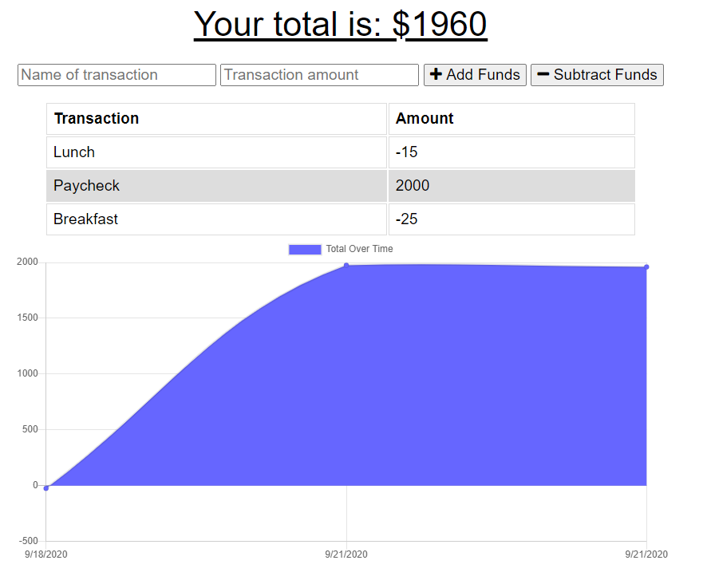

# Budget Tracker 

## Description

This budget tracker will allow you to keep track of expenses and any money you have coming your way. If you need to use this progressive web app offline, any expenses or deposits will be saved and will be recorded the next time you come back online. You can see a demo of the app here: <https://blooming-reef-83436.herokuapp.com/> .

## Table of Contents

- [Installation](#installation)
- [Usage](#usage)
- [Technologies](#technologies)
- [License](#license)
- [Contributing](#contributing)
- [Questions](#questions)

## Installation

If you would like to adapt and use this app, please clone my repo. Make sure you have node.js installed on your computer. You can find the download here <https://nodejs.org/en/download/>. Run npm install to install all dependencies. You can use a local server and database or deploy to MONGODB Atlas and Heroku.

## Usage

This app is intended for tracking a budget. Type in a name for a transaction, the amount, and then add or subtract it from the total.

## Technologies

JavaScript, APIs, Node, Express, Mongoose, MongoDB Atlas, MongoDB Compass, Heroku, Service-Worker, Manifest

## License

GNU General Public License v3.0

The GNU License allows the software to be modified and distributed by other users. It does not impose any restrictions on the use of the software but requires that it remain open source.

## Contributing

Please contribute to this project if you feel that you can make the code more efficient. Create your own branch from the Master and submit a pull request. I ask that you follow the Contributor Covenant code of conduct: <https://www.contributor-covenant.org/version/2/0/code_of_conduct/code_of_conduct.md> 

## Questions

- [Github Profile](https://github.com/melindawinter)
- melindawinter42@gmail.com
- Please email me or connect with me on Linked In: <http://www.linkedin.com/in/melinda-winter-34a25689>.
